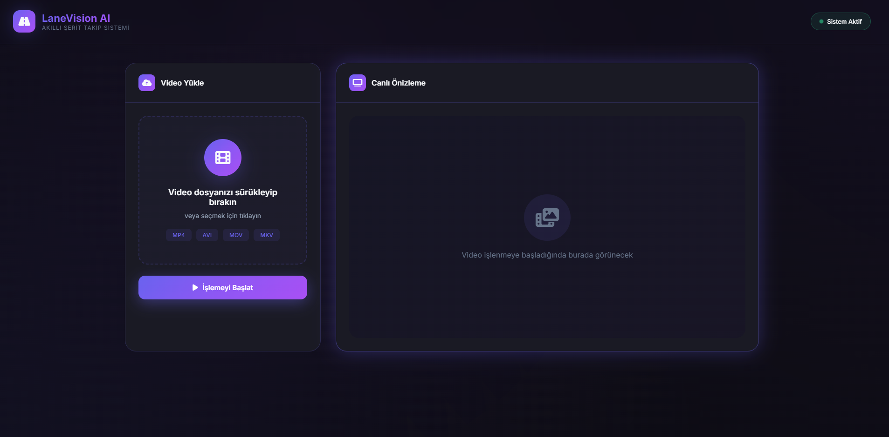
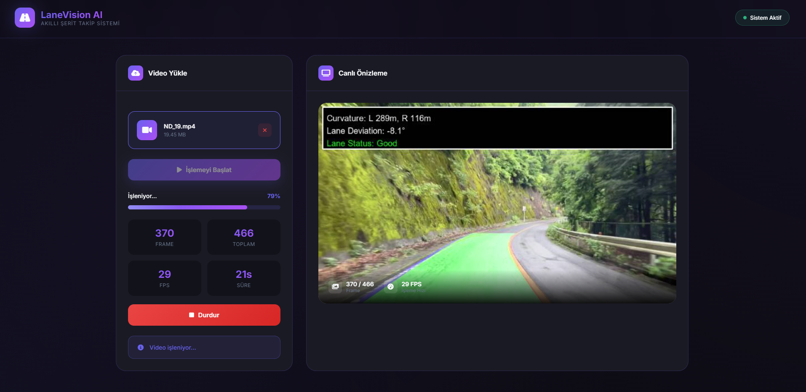

# Lane Vision AI

> Flask + OpenCV kullanılarak geliştirilmiş gerçek zamanlı şerit tespit ve takip sistemi.

Lane Vision AI, yüklenen video dosyaları üzerinde **gerçek zamanlı şerit tespiti, takibi ve analiz** yapan bir bilgisayarlı görü (Computer Vision) projesidir.

Sistem klasik görüntü işleme teknikleri ile çalışır ve sürücüsüz araç sistemleri için temel bir algılama simülasyonu sunar. Ayrıca Flask-SocketIO ile **canlı video akışı (real-time streaming)** desteği sağlar.

---





## Özellikler

- Video yükleme ve işleme
- Gerçek zamanlı şerit tespiti
- WebSocket ile canlı video akışı
- İşlem ilerleme takibi (FPS, frame, süre)
- Şerit sapma açısı hesaplama
- Şerit stabilite ve güven skoru
- İşlenmiş video indirme
- Otomatik dosya temizleme sistemi

---

## Kullanılan Teknolojiler

- Python 3.10
- Flask
- Flask-SocketIO
- OpenCV
- NumPy
- Pillow
- HTML / CSS / JavaScript

---

## ⚙️ Kurulum ve Çalıştırma

### 1. Projeyi klonla
   ```bash
   git clone https://github.com/eminbasbayan/serit-takip.git
   cd serit-takip
   ```

### 2. Sanal ortam oluştur (önerilir)
   ```bash
   python -m venv venv
   # Windows
   venv\Scripts\activate
   # Linux/macOS
   source venv/bin/activate
   ```

### 3. Bağımlılıkları yükle
   ```bash
   pip install -r requirements.txt
   ```

### 4. Uygulamayı çalıştır
   ```bash
   python app.py
   ```

### 5. Tarayıcıdan aç
[http://localhost:5000](http://localhost:5000) adresine giderek uygulamaya erişin.

---

### Konsol Kullanımı

Alternatif olarak, Flask arayüzünü kullanmadan doğrudan Python scripti üzerinden video işleme yapabilirsiniz.

```bash
python process_video.py
```

Bu yöntemde process_video.py dosyası içinde yer alan input_video ve output_video değişkenlerini düzenleyerek giriş (kaynak video) ve çıkış (işlenmiş video) dosya yollarını kendinize göre ayarlayabilirsiniz.

---

## Proje Yapısı

```
lane-vision-ai/
├── app.py                 # Flask backend + API + SocketIO
├── process_video.py       # Şerit tespit algoritması
├── requirements.txt       # Python bağımlılıkları
├── .gitignore             # Gereksiz dosyalar
├── screenshots/           # Görseller
├── uploads/               # Yüklenen videolar
└── output/                # İşlenmiş videolar
```

---

## Sistem Nasıl Çalışır?

1. Kullanıcı video yükler  
2. Video frame frame işlenir  
3. Şerit tespiti yapılır:
   - Renk filtreleme
   - Kenar tespiti (Canny)
   - ROI (ilgi alanı maskeleme)
   - Perspektif dönüşümü
   - Histogram + sliding window
   - Polinom eğri uydurma  
4. Şeritler analiz edilir ve sapma hesaplanır  
5. Sonuçlar canlı olarak ekrana aktarılır  
6. İşlenmiş video kaydedilir  

---

## 🚀 Gelecek Geliştirmeler

- Deep Learning tabanlı lane detection (YOLO / CNN)
- Night mode (gece sürüş desteği)
- Mobile support
- ROS entegrasyonu
- Gerçek araç sensör simülasyonu

---

## License

Bu proje MIT Lisansı altında lisanslanmıştır. 
Detaylar için `LICENSE` dosyasını inceleyebilirsiniz.